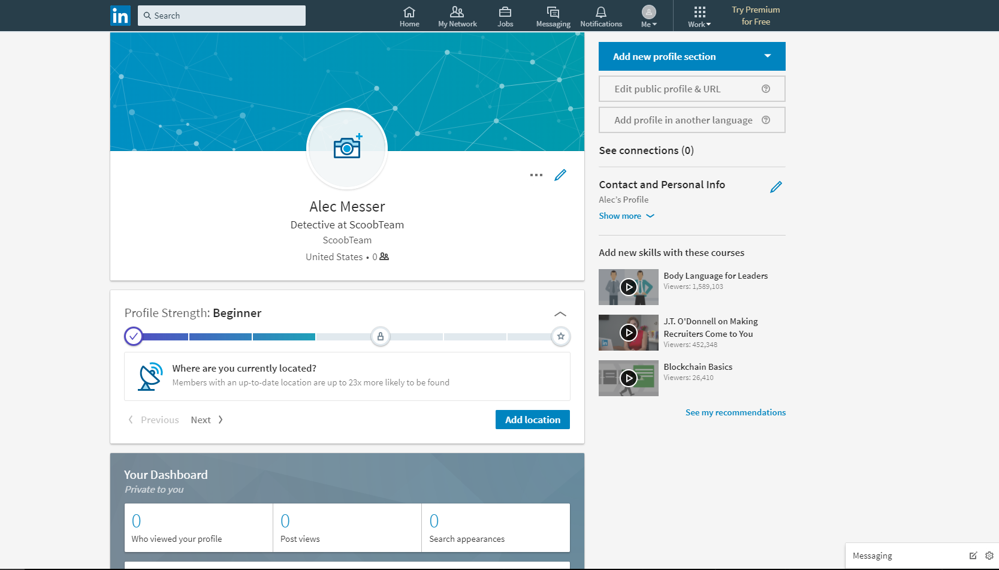
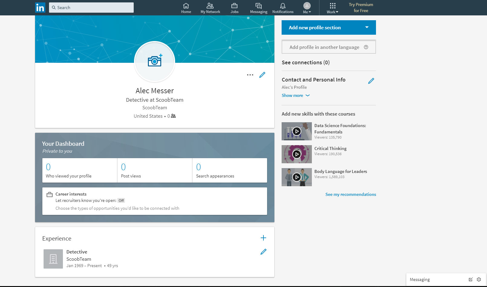
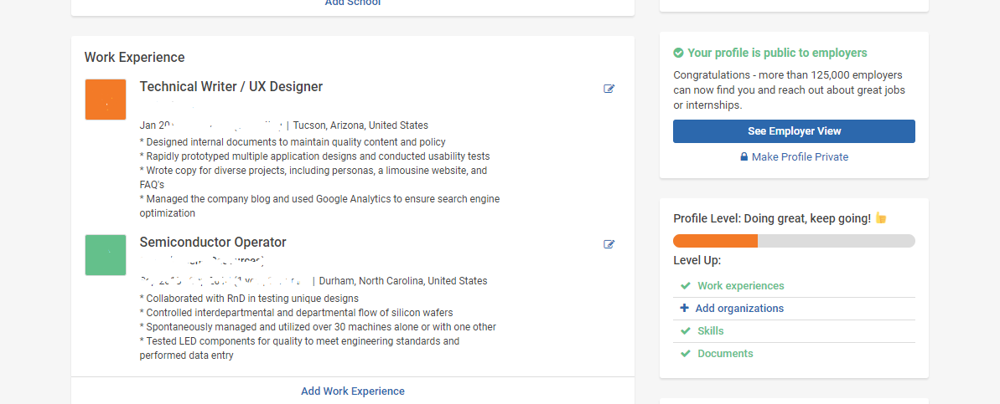
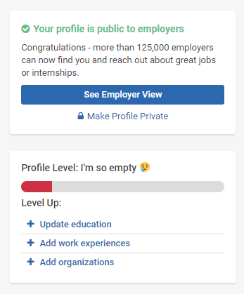
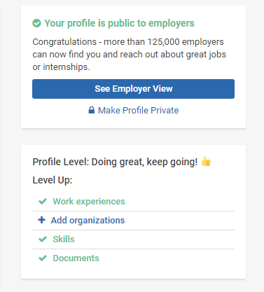
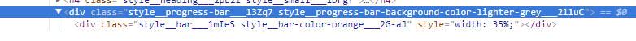

# FIXBUX: A Web-extension to Safeguard Users from Themselves

## Overview

It would seem that people are becoming more conscious of behavior's role in retaining, taking back, and even losing privacy. Privacy technology isn't currently a solution to privacy issues, so it is becoming more important to consider how we interact with these technologies, and how we make decisions. We have a greater propensity to share when our friends share, when we trust the technology maintainers, and defaults surprisingly dictate the way we behave, so what happens when you opt-in, by default, to share your social network data with a host of third parties?

There are certain contexts that we don't think twice when sharing, like when looking for a job and we put our information up on job networking sites. It almost feels like a societal requirement sometimes, like you have to post your resume to these databases that then circulate it to a plethora of *recruiters*. This information often contains addresses, past employment, where you were, and through inference, possibly who you know and interact with.

These sites are responsible for important user data, so how do they influence user behavior? Often with Bully UX. Elements of design can be used to pressure a user into doing something, and this is where Bully UX lies, right between *regular* UX and *dark* UX, where a user might feel inadequate in some way, for not having some quality (or at least not sharing it). A simple web-extension can execute a little bit of Javascript and help users turn a blind eye to these coercive elements.

FIXBUX (Fix Bully UX) is a Chrome web-extension that removes coercive elements.

## Installation

**Requirement:** Google Chrome

**Setup:**
1. ```git clone https://www.github.com/ckhoward/fixbux.git```
2. Open Google Chrome
3. Type ```chrome://extensions``` into the URL bar
4. Enable developer mode
5. Load unpacked extension and select the FIXBUX/FIXBUX/ directory
6. Enable the extension and hit ```Control + R``` to reload
7. Click the extension icon and visit your page of choice

## Case studies

### LinkedIn

LinkedIn initially inspired the idea for this extension, but since its conception, LinkedIn has actually improved their UI to be less coercive and better off for starters. For random example, it doesn't shame a user that may have dropped out of high school by leaving education a permanent requirement—a user can now just choose not applicable. Here is a recent (as of 12/12/2017) design of LinkedIn, for a user just getting started:



While not coercive, it does gently nudge the user to add current location. Being so close to an award motivates my wife to drink as much water possible, and to get her exercise in. People will go a long way for that little reward, and if they are cognizant of this and don't want to, they can just use FIXBUX to remove that urge.



Done. The HTML is gone from your browser. The effects of this can be debated. It can be argued that location is an important parameter when job hunting and networking, but it can also be argued that any data we put online can be circulated and aggregated into something more meaningful about us and our lives. This design seems benign, but perhaps it isn't, and it is worth giving users the flexibility to reduce their cognitive burden in dealing with coercive patterns, or in this case, rewards.

### Handshake

Handshake is less gentle than LinkedIn, and is a prime example of coercive design. Below shows an example of some job experience:



There are a great number of details here, from position, to company, location, and experience. Further down, not shown, there are courses taken, projects worked on, social links that are entered, skills, and a short bio. Above, previous and current colleges are listed along with dates, major, degrees earned, class, GPA, and a picture. With all of this data submitted, that little orange progress bar makes me feel pretty unaccomplished, like I need to do and add more. If I removed any of the content in my page, the bar would turn red, and there would be a frowny face next to it.



I could add more, but I don't want to, and the information that is there already, isn't really worth giving to a company like this. Cue FIXBUX. Anyone can remove these HTML elements without giving a second thought.



Better, right? Companies will always try to compel people into giving more data about themselves, and people will always behave like people. FIXBUX is a rational tool to use in such an environment.

## Implementation

FIXBUX removes HTML elements with simple Javascript and jQuery. Removing the LinkedIn site's progress bar was fairly straightforward since they use a simple naming convention. It can be done with this very basic function:

```Javascript
//Remove LinkedIn Progress Bar
$(document).ready(function(){
    $('div').remove('.pv-pcm-progress');
});
```

Handshake, on the other hand, was a different beast. Being fairly inexperienced with Javascript, I did not know how to deal with the following format of the HTML element:



I tried variations of the last function, referencing things like style(underscore* underscore* progress-bar and progress-bar, but it was to no avail. With the help from others, I learned of new [selector syntax](https://api.jquery.com/attribute-starts-with-selector/). Using the code
 ```Javascript
console.log($("[class^='style__progress']"))
```

I could test different things, like the wildcard, to see if I got any match. The above code worked. At this point it was just adapting it the same way as my previous function:

```Javascript
//Remove Handshake Progress Bar
$(document).ready(function() {
    $("[class^='style__progress']").remove()
});
```
In essence, whenever the extension is enabled, once the page is loaded (all of its elements), the progress bar is removed from the page. In surprisingly little code, a user can be granted more freedom in what designs they are exposed to, which can then influence their behavior and how they share their data with other people and organizations.

## Contributing

Right now this is a tiny project with only two use-cases, but it has potential to be more. Organizations should be dissuaded from using coercive design elements; while I am not delusional in thinking this project will take off and become something huge, I do see potential application elsewhere, and would love for this to be a starter extension that expands into different domains, and starts covering different sorts of HTML elements.

Anybody is welcome to contribute to the project, just be sure to stop by the [Code of Conduct](https://github.com/ckhoward/FIXBUX/blob/master/CODE_OF_CONDUCT.md) page to get an idea of the groundrules. Otherwise, happy contributing.
